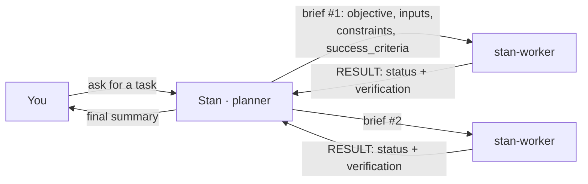

# Stan — an orchestrator and its workers, on OpenCode

Stan is a two-role, two-model pattern: one model **plans and delegates**
(Stan), the other **executes** concrete subtasks (the worker). The goal
is to use an expensive/capable model only for thinking, and a
cheap/fast model for the mechanical work — no frameworks, no custom
queues, no orchestration code: it all runs on [OpenCode](https://opencode.ai)'s
native agent/subagent mechanism.

## How it works



- **Stan can't edit files.** The permission is denied on purpose
  (`permission: {edit: deny, write: deny}` in its agent definition).
  Delegating is its only path — this isn't a convention, it's an actual
  restriction.
- **Every delegation travels as a "brief"**, never as the full
  conversation history: objective, inputs (exact files), constraints
  (project conventions), and `success_criteria`.
  Full example in [brief-contract.md](brief-contract.md).
- **`success_criteria` is an executable command, never prose.** Not
  "the tests pass" but the literal `bun run test`. The worker actually
  runs it after making the change — it doesn't declare itself successful,
  it reports the command's real output.
- **The worker replies with a structured `RESULT`**, never the full
  artifact: `status` (`success` / `failed` / `blocked`), `summary` (one
  line), and `verification` (the real output of the `success_criteria`
  commands). Stan decides based on that — it only opens the full
  artifact if something doesn't add up, or for the final review.
- **`AGENTS.md`** holds the project's stable conventions (stack, style,
  test commands). It's the shared prefix of every call — nothing
  task-specific belongs there.

## Usage

From the root of the project where you want Stan to work, the fastest
way (no cloning needed):

```bash
curl -fsSL https://raw.githubusercontent.com/rokkoo/stan-orch/main/setup.sh | bash
```

`setup.sh` is self-contained — it doesn't need the rest of the repo to
work, so that one command is enough. Before running any `curl | bash`
(this one included), it's worth taking a look at the script first:

```bash
curl -fsSL https://raw.githubusercontent.com/rokkoo/stan-orch/main/setup.sh
```

Alternative, cloning the repo:

```bash
git clone https://github.com/rokkoo/stan-orch stan-agent
bash stan-agent/setup.sh
```

`setup.sh` is an installer: it checks that you have OpenCode, lets you
pick the **scope** of the install and the **model** for Stan and the
worker, and generates the agents.

**Scope — repo or global:**

- **Repo** (option 1): writes to `.opencode/agents/` inside the current
  project. Stan only exists there. Recommended for trying it out, or for
  projects with their own conventions (also uses `AGENTS.md`).
- **Global** (option 2): writes to `~/.config/opencode/agents/`. Stan
  becomes available in every project you open with OpenCode on that
  machine. Doesn't create `AGENTS.md` (conventions are per-repo; add one
  in each project if you want to give Stan context there).

These are the officially documented OpenCode paths for custom agents
(the `.md` filename becomes the agent's identifier — that's why
`stan.md` → agent `stan`). `AGENTS.md` is a different concept: it
doesn't define agents, it's behavior instructions that OpenCode looks up
in a cascade (local → global → Claude Code's `~/.claude/CLAUDE.md`, if
present).

**Model:** the script doesn't force any fixed pair. For Stan and,
separately, for the worker, each person searches and picks from what
**they already have available** in their own OpenCode — filtering by
text over `opencode models` (type `codex`, `claude`, `deepseek`...), or
typing a `provider/model` directly if they already know it. It doesn't
matter who runs it or which providers they have: the list comes from
their own install, not from this repo.

It never asks for an API key: it reads whatever each person already has
configured in OpenCode (`opencode providers list` / custom providers in
`opencode.json`). Any provider counts, not just the official ones — for
example, a custom OpenAI-compatible provider added by hand shows up in
`opencode models` the same way, and is just as eligible for Stan or the
worker, no extra steps needed. Everyone on the team sees their own list
based on their own providers. If someone doesn't have a provider logged
in or configured, `opencode models` will tell them with an empty or
short list when filtering by that provider.

## Try it

```bash
opencode          # Tab until you reach the 'stan' agent
```

Ask for something divisible ("add docstrings to every file in src/")
and watch it write briefs and delegate to `@stan-worker`.

## Customization

The agents are two markdown files, `stan.md` and `stan-worker.md`, in
`.opencode/agents/` (or in `~/.config/opencode/agents/` if you installed
them globally). The filename is the agent's identifier — that's why the
`stan-` prefix: it keeps it distinct from any other `worker` agent that
might exist in the same scope (especially in a global install, where
agents from several sources coexist).

Change the `model` field to try other pairs (the worker's is required:
if it's missing, it inherits Stan's and you lose the whole point of the
pattern), or duplicate `stan-worker.md` under a different name and
`description` to get specialized workers — for example
`stan-worker-tests.md` and `stan-worker-docs.md` — and update the
matching `@stan-worker-tests` reference inside `stan.md`'s prompt.

**About `temperature`:** it controls how much the model "gambles" when
picking each token. Close to `0` → nearly deterministic (same input,
similar output every time); close to `1` → more varied/creative, but
also more likely to drift. The worker uses `0.1` because it should only
execute a closed brief, with no room for interpretation — creativity
doesn't help there. Stan doesn't set the field and uses the model's
default (usually higher), because planning and breaking down a task
benefits from a bit more flexibility. Heads up: some "reasoning" models
(o1/o3, `gpt-5-codex*`, etc.) ignore `temperature` or fix it at `1` — if
you pick one of those as the worker, the field just has no real effect.

## When NOT to use this

Tasks that fit in a single call, problems that don't split cleanly,
interactive flows where latency matters, or low volume. If a task isn't
clearly divisible into independent subtasks, Stan adds more coordination
overhead than it saves.

## License

MIT.
